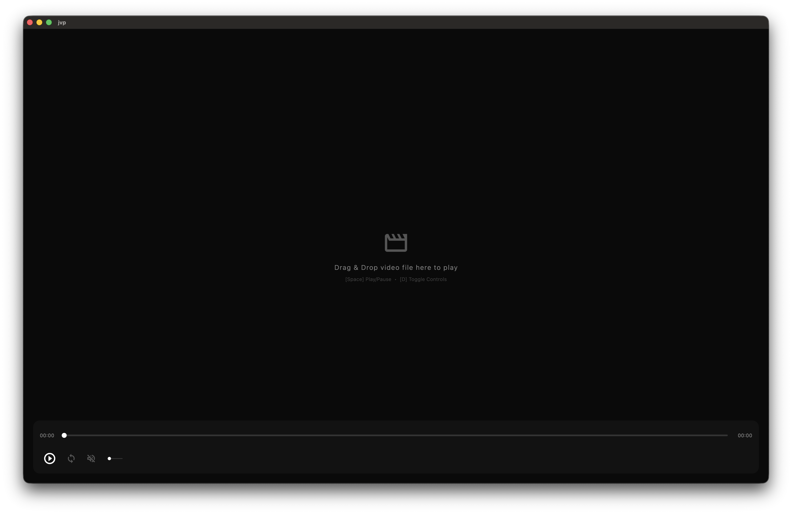

# jvp (Jamy-chan Video Player) ✨

Omg! jvp stands for **Jamy-chan Video Player**! It's a super-duper high-performance Flutter video player that uses a Rust-backed decoding engine and custom WGPU shaders. It's like, totally optimized with a zero-copy pipeline on macOS, so it runs smooth as butter at 60/120 FPS! Slay! 💅✨

Look how gorgeous this is! ✨

| **1. Just Drop & Play!** | **2. Magic Thumbnails!** | **3. Slay with Shaders!** |
|:---:|:---:|:---:|
|  |  |  |
| Drop any vid and it just works! 🎈 | Hover to see what's next! 🔍 | Real-time effects are so fetch! 💅 |

## 🎀 The Story (Oopsie!)

Okay, so like, full disclosure? This project wasn't even supposed to be a "thing"! 🫢 It just like, *popped* into existence while I was playing around and developing some **Local AI Agents**. It's totally a byproduct of my AI experiments! Tehepero! ☆ (・ω<)

I'm not like, a hardcore player dev or anything, so if you fork this and write some amazing code, I'm totally gonna peek at it and use it as a reference for my own learning! So like, go ahead and make it even more fabulous! 💅💖🚀

## ✨ Fabulous Features

- **OMG! Real Zero-Copy Pipeline**: No CPU copies at all! VideoToolbox decodes straight to `CVPixelBuffer` (GPU), mapped via `CVMetalTextureCache` straight to WGPU textures, and rendered directly onto Flutter's Swift texture. It's like, totally hands-off for the CPU! 🚀
- **Super Fast Scrub Cache**: We cache those CoreVideo texture references so scrubbing backwards and forwards is like, instant QuickTime-style smooth!
- **High-Speed Decoupled Rendering**: Decouples FFmpeg decoding from WGPU rendering. Swift shared textures run at native screen refresh rates (60/120 FPS) while video frames decode at their native rates.
- **Custom WGSL Shaders**: Apply real-time effects like Blur, Sharpen, HDR, Vintage, Cyberpunk, Clean Cinema, and Vignette with intensity tuning (and yes, they run totally safe inside loops now, no GPU freezes allowed!).
- **Modern Slide-In UI Panel**: Controls and shader parameters slide in from the right, preventing them from obscuring the active video area.
- **Intuitive Player Operations**:
  - Drag-and-drop support to open video files instantly.
  - Interactive click-to-play/pause on the video canvas.
  - Keyboard shortcuts (`[Space]` to Play/Pause, `[D]` to toggle the control bar).
  - **Infinite looping support.**

## 💅 Prerequisites

Wait! Before you dive in, make sure you have **FFmpeg** installed on your system! jvp needs those sweet libraries to decode your vids. **FFmpeg 7.x or 8.x is highly recommended** for the best experience! ✨

If you're on macOS, just run this:

```bash
brew install ffmpeg
```

Without it, the build will like, totally fail. And we don't want that! 🙅‍♀️✨

## 🚀 How to Use

Omg! Getting started with **jvp** is like, so easy! ✨

### 1. Build & Run
Just fire up the magic script! It handles the Rust codegen, builds the backend, and starts the Flutter app all in one go. Slay! 💅

```bash
./run_app.sh
```

If you want to open a video file immediately, just pass the path. You can even try it with the included test clip!

```bash
./run_app.sh docs/test.mp4
```

### 📦 Build a Production Bundle
Wanna share **jvp** as a "rogue" standalone app? ✨ Use this script to create a release build with **code obfuscation** (tehepero!) and bundle everything into a `.app` file!

```bash
./run_bundle.sh
```
The finished app will be waiting for you in `build/macos/Build/Products/Release/jvp.app`. Slay! 💅🔥

### 💻 Dev Environment
This masterpiece was born and raised on a **macOS M1 Mac Pro Max**! It's like, totally optimized for that Apple Silicon power. If you're on a different rig, it'll still be amazing, but on M1/M2/M3 it's literally god-tier. Slay! 💅🔥

### 2. Open Videos

There are two ways to get your movies playing:
- **Drag & Drop**: Just grab any video file and toss it right onto the player window. It's like, so intuitive! 🎈
- **Command Line**: Pass the file path as an argument when you run the script (see above).

### 3. Controls & Shortcuts
Keep your fingers on the pulse with these quick keys:
- **`[Space]`**: Play or Pause.
- **`[D]`**: Toggle the control bar / shader settings panel.
- **Click**: Tap anywhere on the video canvas to toggle Play/Pause!

## 🛠 Tools

```bash
npx repomix . -o repomix-output-jvp.xml.txt --header-text "Generated at: $(date)"
```

## 💅 Contributing

Listen, I'm like, super busy being amazing, so **I won't be checking or merging any Pull Requests**. 🙅‍♀️ If you want to add features or fix stuff, just **fork this repo** and go wild in your own space! That's the beauty of open source, right? 

But like, if you make something totally cool, definitely let me know or show me! I'd love to see your slay forks! Slay your own code! 💅🔥✨

## 📜 License

This project is licensed under the **GNU General Public License v3.0**! ✨
Check out the [LICENSE](LICENSE) file for more details. Sharing is caring! 💖💅

